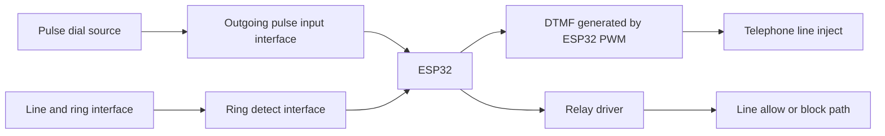
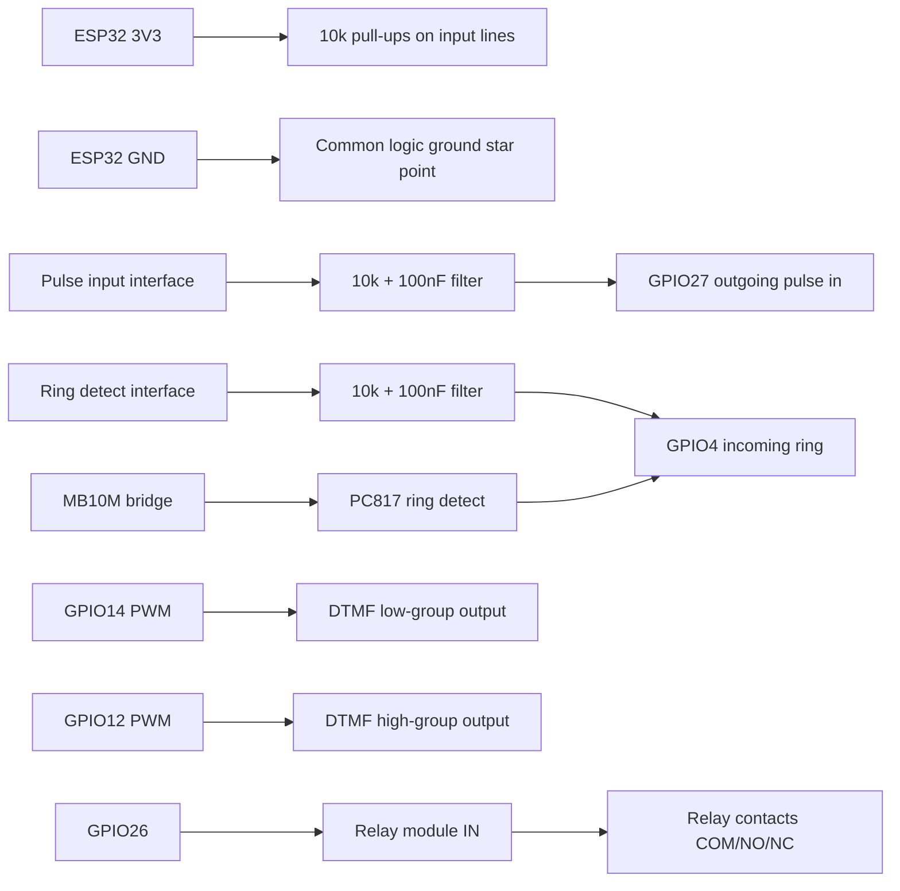

# PhoneFilter

Firmware for ESP32 that filters telephony at the **relay** and **DTMF** layers: incoming rings are accepted or blocked from policy, and outgoing pulse dialing is validated before the firmware replays the number as DTMF. Configuration and static assets live on **LittleFS**; the management UI is served over **HTTPS** with **TOTP** for the normal console. The **Wi-Fi setup hotspot** only exposes **Wi-Fi** configuration without TOTP until you are on the LAN (or log in).

## Features

- **Number filtering**: Blacklist and whitelist together (prefix matching) for "block broad / allow narrow" policies.
- **Pulse to DTMF**: Outgoing pulse dialing is read on a GPIO line and retransmitted as DTMF (PWM).
- **Outgoing routing**: Prefix allow/deny lists plus shortcut expansion before dial-out.
- **Incoming filtering**: Ring detection drives allow/block on the relay line according to the same list model (CLI decode is not in scope; policy uses a synthetic marker so wildcard rules still apply).
- **Number normalization**: Prefix logic treats international forms (`+` vs `00`) consistently.
- **Web UI**: Tabbed interface (`Incoming`, `Outgoing`, `Settings`) on top of ESP-IDF HTTPS + ESPAsyncWebServer handlers.
- **Wi-Fi bootstrap**: If STA is not configured or association times out (~45 s), the chip opens an **open SoftAP** (`PhoneFilter-` + last MAC octets). The web UI opens **Settings → Wi-Fi only** (no TOTP): time is set from your phone (`POST /api/totp/time/provision`), then save **Wi-Fi** and reboot. The **full** console (lists, TLS, OTA, etc.) requires **TOTP login** once the device is reachable on your LAN (or on the hotspot if you log in). **Buttons on a typical DevKit**: **EN** is wired to the chip reset line — it only **reboots** (no Wi‑Fi erase). **BOOT** (usually **GPIO0**) is read in firmware: hold **BOOT** ~**5 s** *while the app runs* to clear Wi‑Fi in `config.json` and reboot into the setup hotspot (serial monitor prints progress while you hold). Set `WIFI_FACTORY_RESET_PIN = -1` in `telephony_hw.h` to disable, or change the pin for boards where BOOT is not GPIO0 (e.g. some ESP32‑C3 modules).
- **TOTP**: Required for authenticated management; bootstrap flow when no active secret exists.
- **Time**: NTP sync for TOTP windows.

## Prerequisites

- **Hardware**: ESP32 board (for example ESP32 DevKit).
- **Toolchain**: PlatformIO (VS Code extension or CLI), Arduino framework target.
- **Libraries**: Resolved automatically — ArduinoJson, ESPAsyncWebServer, AsyncTCP (see `platformio.ini`).

## Quick start

1. Clone and enter the project:
   ```bash
   git clone https://github.com/jbdelavoix/phone-filter.git
   cd phone-filter
   ```

2. **TLS** — A **shared dev-only** self-signed certificate and key ship in `data/config.json` and as firmware defaults in `src/config.cpp`, so HTTPS can start right after flashing LittleFS. Replace them (edit JSON, use `/api/tls/config` once logged in — legacy `/api/https/config` still works — or your own PKI) before any sensitive deployment.

3. Open the folder in VS Code with the PlatformIO extension (or use the CLI only). Dependencies resolve on first build.

4. **Wi-Fi** — Stored at runtime in `data/config.json`. For a first install you can leave SSID/password empty, or if STA fails: connect to **`PhoneFilter-xxxx`**, open **`https://192.168.4.1/`** — the UI offers **Wi-Fi only** (no TOTP); it sets time from your phone, then **Settings → Wi‑Fi** and save.

5. Build, flash firmware, flash filesystem, serial monitor:
   ```bash
   pio run -e esp32dev -t upload -t uploadfs -t monitor
   ```
   With the **dual OTA** partition table, **`./stack start`** (or `upload` / `flash`) is safer than raw `pio upload`: the helper **erases `otadata` after USB firmware upload** so the device boots the slot you just flashed. Plain PlatformIO upload skips that step.

   Optional helper (same flows, shorter commands): `./stack start` after `chmod +x stack`.

### First login (TOTP)

- With an empty `totp_secrets` array, open `https://<device-ip>/` (accept the browser warning for the dev certificate).
- Use the bootstrap API or the UI flow: `GET /api/totp/bootstrap/status`, then `POST /api/totp/bootstrap/new` to create a pending secret; complete activation in the UI so an **active** secret exists before locking the device down.
- See `data/api/docs/openapi.yaml` for the full contract.

## Build and deploy

### Wi-Fi (`config.json`, setup AP, reset gesture)

- **Storage**: `wifi_ssid` / `wifi_password` in **`/config.json` on LittleFS** — edit `data/config.json` before `uploadfs`, use **Settings → Wi-Fi** when HTTPS works, or the **setup hotspot** below.
- **STA first**: With a non-empty `wifi_ssid`, the firmware tries to join that network for up to **~45 s** (`WIFI_STA_CONNECT_TIMEOUT_MS` in `telephony_hw.h`).
- **Setup hotspot**: If the SSID is **empty** or **STA fails**, the ESP32 becomes an **open** access point **`PhoneFilter-` + 4 hex chars**. The UI only shows **Wi-Fi** (and device time) until you log in with TOTP. **`http://<ap-ip>/`** redirects to **HTTPS**. On your **LAN**, changing **Wi-Fi** requires an authenticated session. **Factory reset (Wi-Fi clear)**: hold **BOOT** (see `WIFI_FACTORY_RESET_PIN`, **GPIO0** on classic ESP32 DevKit) to GND ~**5 s** while the app runs — clears Wi-Fi in `config.json` and reboots into this hotspot; **`EN`/`RST` only reboot** (no erase). Set pin **`-1`** in `telephony_hw.h` to disable. Serial prints while you hold BOOT; STA connect polls this gesture during the ~45 s join attempt.
- **Trust**: On the setup AP, **only Wi-Fi** (plus clock provisioning) is exposed without TOTP — other API routes still need a session. Anyone in Wi-Fi range can set **Wi‑Fi** until the device joins your LAN — use only in a controlled environment.
- **After Wi-Fi change on LAN**: Saving Wi-Fi in Settings may report **`needs_restart`** — reboot so STA applies new credentials (on setup AP, save triggers an automatic reboot).

⚠️ Anyone within Wi-Fi range of the open setup AP can complete this flow until the device joins your LAN — mitigate physically or in time.

### Compile only

```bash
pio run --environment esp32dev
```

(No environment variables are required for Wi-Fi; the build is credential-agnostic.)

### Flash firmware

```bash
pio run --target upload --environment esp32dev
```

Prefer **`./stack upload`** if you use the dual-slot OTA layout: it runs the same upload, then **erases the `otadata` partition** (see `partitions_ota.csv`) so the next boot picks **ota_0**. Raw `pio upload` does not. Skip the erase with `SKIP_ERASE_OTADATA=1`. Optional: `ERASE_OTADATA_BAUD` (default `460800`).

### Flash LittleFS (HTML, `config.json`, OpenAPI bundle)

```bash
pio run --target uploadfs --environment esp32dev
```

### One-shot: firmware + FS + monitor

```bash
pio run --target upload --target uploadfs --target monitor --environment esp32dev
```

### OTA update (HTTPS + TOTP)

The firmware uses a **dual-slot** partition table (`partitions_ota.csv`, 4 MB boards). After the first flash with this layout, you can upload a new `firmware.bin` over the network:

**Web UI:** after login, open **Settings** → **Firmware (OTA)**: choose `firmware.bin`, enter the current TOTP, then **Install OTA**.

**CLI:** `./stack ota` — builds by default (unless `--no-build` or `OTA_SKIP_BUILD=1`), prompts for a 6-digit TOTP, then logs in and uploads `.pio/build/<env>/firmware.bin`. Set **`OTA_URL=https://<device-ip>`** or **`OTA_HOST=<device-ip>`** in `.env` (or the environment). Self-signed dev certs: ignored by default (`curl -k`); set **`OTA_INSECURE=0`** to enforce TLS verification. Needs **`curl`**. Login JSON is parsed with **`jq`** if installed, otherwise **`python3`**.

**API / curl:** On the **LAN**, log in via `/api/auth/login` and pass `X-Session-Token`. On the **setup SoftAP**, session is optional — **OTA** still requires a valid **`X-TOTP`** header. Example with curl (self-signed dev cert: `-k`):

```bash
export IP=192.168.1.xxx
export TOKEN=your_session_token
export TOTP=123456
curl -k -X POST "https://${IP}/api/firmware/ota" \
  -H "X-Session-Token: ${TOKEN}" \
  -H "X-TOTP: ${TOTP}" \
  -H "Content-Type: application/octet-stream" \
  --data-binary @.pio/build/esp32dev/firmware.bin
```

**First time** switching to this partition scheme on a board that had the old layout: erase flash or use a full reflash so the new table and LittleFS layout apply; then run `upload` and `uploadfs` again.

Details: `data/api/docs/openapi.yaml` path `/api/firmware/ota`.

## Testing

Run native (host) unit tests with Unity:

```bash
pio test --environment native
```

The suite starts with a placeholder test under `test/test_placeholder/`; add real cases as you extract testable logic from firmware code.

## Serial monitor

```bash
pio device monitor --environment esp32dev
```

## Configuration

- **`data/config.json`**: Includes the same **development** TLS pair as `src/config.cpp` so the HTTPS server can run after `uploadfs`. Treat this material as **public** (any clone shares it); replace the PEM fields or use `/api/tls/config` (`/api/https/config` is an alias) before exposing a device more broadly.
- **Runtime**: The UI at `https://<device-ip>/` updates lists and routing; changes are written back to `config.json` on LittleFS.
- **Pins and timing**: `src/telephony_hw.h`.
- **Secrets**: The checked-in `data/config.json` ships with `totp_secrets` empty so a fresh flash uses the bootstrap flow. After provisioning, secrets live in `totp_secrets` on the device. **Wi-Fi password** is stored in plaintext in `config.json` like the TLS private key — treat the file as sensitive on the device. Manage via the UI or `/api/totp/*` (see OpenAPI). Do not commit production TOTP material or production private keys.

## Policy examples

### Incoming filtering model

- Rule: block broad with `incoming_blacklist`, allow narrow with `incoming_whitelist`.
- `*` is valid in incoming lists too. Example: `incoming_blacklist: ["*"]` blocks all incoming calls, then whitelist re-allows selected prefixes.
- Current example:
  - `incoming_blacklist: ["+2", "+4"]`
  - `incoming_whitelist: ["+212", "+442026"]`
  - `+212...` and `+442026...` are allowed; `+4930...` is blocked.

### Outgoing filtering model

- Rule: block broad with `outgoing_blacklist`, allow narrow with `outgoing_whitelist`.
- `*` is valid here too. Example: `outgoing_blacklist: ["*"]` blocks all outgoing calls, then whitelist re-allows selected prefixes.
- Current example:
  - `outgoing_blacklist: ["*"]`
  - `outgoing_whitelist: ["+33", "+442026"]`
  - `outgoing_shortcuts: [{"trigger":"1","replacement":"+33123456789"},{"trigger":"2","replacement":"+442026123456"}]`
  - Dialing `1` and `2` is allowed because shortcuts expand to whitelisted numbers.

## Electronics / Wiring

The practical target for this project is:

- **Outgoing path**: pulse input -> ESP32 -> DTMF generation (PWM on ESP32).
- **Incoming path**: ring detect only.
- **Line control**: relay driven by ESP32.

### High-level block diagram
x


### GPIO mapping (from `src/telephony_hw.h`)

- Outgoing pulse input: `OUTGOING_PULSE_IN_PIN` = `GPIO27`
- DTMF outputs (PWM-driven by ESP32):
  - `DTMF_LOW_OUT_PIN` = `GPIO14`
  - `DTMF_HIGH_OUT_PIN` = `GPIO12`
- Incoming ring detect: `INCOMING_RING_PIN` = `GPIO4`
- Relay control: `RELAY_PIN` = `GPIO26`

### Practical notes

- Do not connect ESP32 GPIOs directly to a phone line. Use proper interface stages (isolation, level shifting, protection).
- Keep all ESP32 logic signals within 3.3V limits.
- Start by validating each path independently:
  - ring pin toggles when ring is present,
  - outgoing DTMF PWM is present and stable,
  - relay toggles from firmware events.

### Suggested components (BOM)

This is a practical starting BOM for one prototype build (aligned with your available parts):

- **Controller**
  - 1x ESP32 dev board (3.3V logic)
- **Relay path**
  - 1x relay module (5V/12V/24V, 3-pin control side + 3-pin contact side)
- **Signal conditioning / protection**
  - 2x `PC817` optocouplers for ring/pulse interface isolation
  - 1x `MB10M` bridge rectifier DIP-4 on ring detect input for polarity-insensitive detection
  - 1x series resistor sized for the detect path
- **Passives**
  - Pull-up/pull-down resistors (4.7k, 10k typical)
  - Series resistors (220R to 1k on GPIO-facing lines)
  - Decoupling capacitors (100nF near each module/chip)
  - Bulk capacitor on power rail (10uF to 47uF)

### Typical interface values (starting point)

Use these as first-pass values, then tune on bench:

- **Digital pull-ups (ESP32 inputs):** `10k` to 3.3V
- **Stronger pull-ups for noisy lines (if needed):** `4.7k` to 3.3V
- **GPIO series resistor:** `330R` (limit transients/ringing)
- **RC debounce/filter for pulse or ring detect (logic side):**
  - `R = 10k`, `C = 100nF` (tau ~1ms)
  - increase to `C = 220nF` if needed
- **Decoupling per board/module IC:** `100nF` ceramic close to VCC/GND
- **Rail bulk capacitor:** `22uF` electrolytic/tantalum near module power entry
- **Relay module (your setup):**
  - Connect `GPIO26` directly to relay module control input.
  - No extra transistor or flyback diode required on ESP32 side when using a complete relay module.
- **Discrete relay only (not your current setup):**
  - Base resistor `1k` (ESP32 GPIO -> NPN base)
  - Flyback diode directly across coil
- **Ring detect front-end with `PC817` + `MB10M` (starting point):**
  - put `MB10M` before optocoupler LED so input polarity does not matter
  - series resistor on optocoupler LED side sized for expected ring voltage/current
  - logic side: `PC817` transistor collector with `10k` pull-up to 3.3V, emitter to GND

### Reference low-voltage wiring (logic side)



### KiCad-ready schematic guide

Use this as a direct template in KiCad (`eeschema`) with reference designators and net labels.

**Main symbols**

- `U1`: ESP32 dev board header symbol
- `BR1`: `MB10M` bridge rectifier
- `U2`: `PC817` (ring detect optocoupler)
- `U3`: `PC817` (pulse input optocoupler)
- `K1`: relay module connector (control side `VCC/GND/IN`, contact side `COM/NO/NC`)
- `J1`: line/ring input connector (from FXS/line detect point)
- `J2`: pulse input connector
- `J3`: DTMF output connector (to analog/tone stage input)

**Passives**

- `R1`: ring input current-limit resistor (value depends on source level)
- `R2`: pull-up on ring detect output (`10k` to `+3V3`)
- `R3`: pull-up on pulse detect output (`10k` to `+3V3`)
- `R4`: series on `GPIO14` PWM (`330R`)
- `R5`: series on `GPIO12` PWM (`330R`)
- `C1`: ring detect filter capacitor (`100nF` to GND, optional)
- `C2`: pulse detect filter capacitor (`100nF` to GND, optional)
- `C3`: decoupling near interface (`100nF`)
- `C4`: bulk on `+3V3` rail (`22uF`)

**Net labels**

- Power: `+3V3`, `GND`
- ESP32 GPIO nets:
  - `OUTGOING_PULSE_IN` -> `GPIO27`
  - `INCOMING_RING_IN` -> `GPIO4`
  - `DTMF_PWM_LOW` -> `GPIO14`
  - `DTMF_PWM_HIGH` -> `GPIO12`
  - `RELAY_CTRL` -> `GPIO26`
- Line-side nets:
  - `LINE_A`, `LINE_B` (from `J1` to `BR1` AC pins)
  - `RING_RECT_P`, `RING_RECT_N` (bridge outputs)

**Connection checklist**

- `J1.LINE_A` / `J1.LINE_B` -> `BR1.~` / `BR1.~`
- `BR1.+` -> `R1` -> `U2` LED anode, `U2` LED cathode -> `BR1.-`
- `U2` transistor collector -> net `INCOMING_RING_IN`, emitter -> `GND`
- `R2` from `INCOMING_RING_IN` to `+3V3`
- `C1` from `INCOMING_RING_IN` to `GND` (optional debounce/filter)
- `J2` (isolated pulse source) -> `U3` input side
- `U3` transistor collector -> net `OUTGOING_PULSE_IN`, emitter -> `GND`
- `R3` from `OUTGOING_PULSE_IN` to `+3V3`
- `C2` from `OUTGOING_PULSE_IN` to `GND` (optional)
- `DTMF_PWM_LOW` -> `R4` -> `J3.LOW_IN`
- `DTMF_PWM_HIGH` -> `R5` -> `J3.HIGH_IN`
- `RELAY_CTRL` -> `K1.IN`, `+3V3/GND` adapted to relay module logic side requirements
- `C3` near `U2/U3` supply area, `C4` on board `+3V3`

**Important**

- Keep line-side (`J1`, `BR1`, opto LED side) physically separated from logic-side (`U1`, GPIO nets).
- If your relay module control input is not 3.3V-compatible, add a level-shift transistor stage on `RELAY_CTRL`.

### Safety

- Keep line-side and ESP32 logic-side isolated (PC817 on ring/pulse paths).
- For internet box FXS ports this is usually easier/cleaner than legacy PSTN lines, but keep basic isolation and current limiting.
- Validate with a current-limited bench setup before connecting to a real line.

## Project layout

| Path | Role |
|------|------|
| `src/` | Firmware (Arduino / ESP-IDF HTTPS). |
| `data/` | LittleFS assets: UI, default `config.json`, OpenAPI bundle. |
| `kicad/` | Schematic starter notes, BOM, net list, ERC checklist. |
| `platformio.ini` | Environments `esp32dev` and `native`. |
| `stack` | Optional shell wrapper around common `pio` commands. |

## API Reference

- OpenAPI spec: `data/api/docs/openapi.yaml`
- Swagger UI page served by device: `/api/docs/index.html`
- Includes TOTP bootstrap endpoints (`/api/totp/bootstrap/status`, `/api/totp/bootstrap/new`) and authenticated management endpoints.

## KiCad Starter

- KiCad quick-start bundle: `kicad/README.md`
- BOM template: `kicad/phonefilter_mvp_bom.csv`
- Net naming and connection map: `kicad/phonefilter_mvp_nets.md`
- ERC sanity checklist: `kicad/phonefilter_mvp_erc_checklist.md`

## Development

- Push to `master` and tags `v*` run CI (`.github/workflows/build.yml`): firmware build `pio run -e esp32dev` and native tests `pio test --environment native`. Pushing a tag like `v1.2.3` also publishes a **GitHub Release** with `phonefilter-esp32dev-v1.2.3.bin` and a SHA-256 checksum file (use that `.bin` for USB flash or HTTPS OTA as usual).
- Prefer small, reviewable changes. Issues and pull requests are welcome; see [CONTRIBUTING.md](CONTRIBUTING.md).
- For TLS and secrets, see [SECURITY.md](SECURITY.md).

## License

[MIT](LICENSE)
